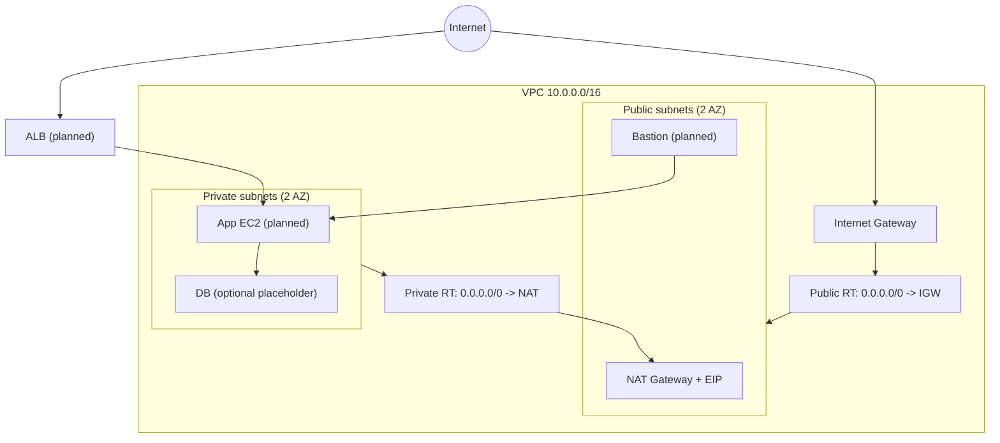
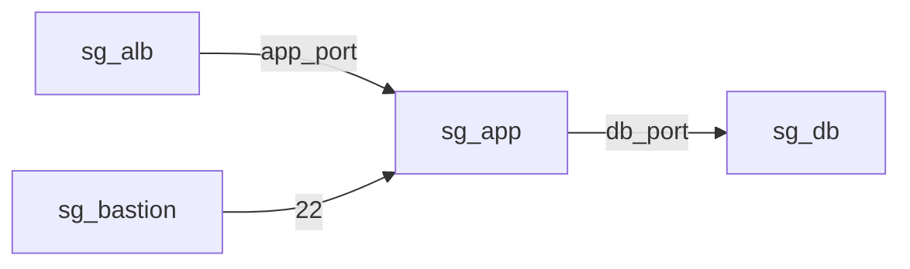

# AWS Networking Foundation (Terraform)

Multi-tier AWS VPC architecture built with Terraform.

This repo focuses on **production-style AWS networking fundamentals**:
- VPC + public/private subnets across 2 AZs
- IGW + NAT Gateway + route tables (private egress via NAT)
- Security Groups module (ALB / Bastion / App / DB) with least-privilege rules
- CI checks for Terraform formatting + validation + linting (TFLint)

> Goal: ship infrastructure iteratively via Issues → feature branches → PRs → CI checks → squash merge.

---

## Architecture diagram



### Security Group flow



---

## Repo structure

```text
.
├── terraform/
│   ├── main.tf
│   ├── variables.tf
│   ├── outputs.tf
│   ├── providers.tf
│   ├── versions.tf
│   └── modules/
│       ├── vpc/
│       └── security_groups/
└── .github/workflows/terraform-ci.yaml
```

### Modules
- `modules/vpc`: VPC, subnets, IGW, NAT, route tables, associations
- `modules/security_groups`: SG containers + explicit SG rules (avoids dependency cycles)

---

## Workflow (GitHub / prod-like)

- `main` is protected (PR required)
- branches: `feat/*`, `fix/*`, `docs/*`, `chore/*`
- CI runs on PRs:
  - `terraform fmt -check -recursive`
  - `terraform init -backend=false`
  - `terraform validate`
  - `tflint` (AWS ruleset)

---

## Local checks

```bash
cd terraform
terraform fmt -recursive
terraform init -backend=false
terraform validate
```

---

## Roadmap
Planned incremental PRs:
- ALB + Target Group + Listener
- Bastion host (or SSM-only access)
- App EC2 placeholder in private subnet
- DB placeholder (RDS optional, or SG-only placeholder)
- NACLs + additional hardening
